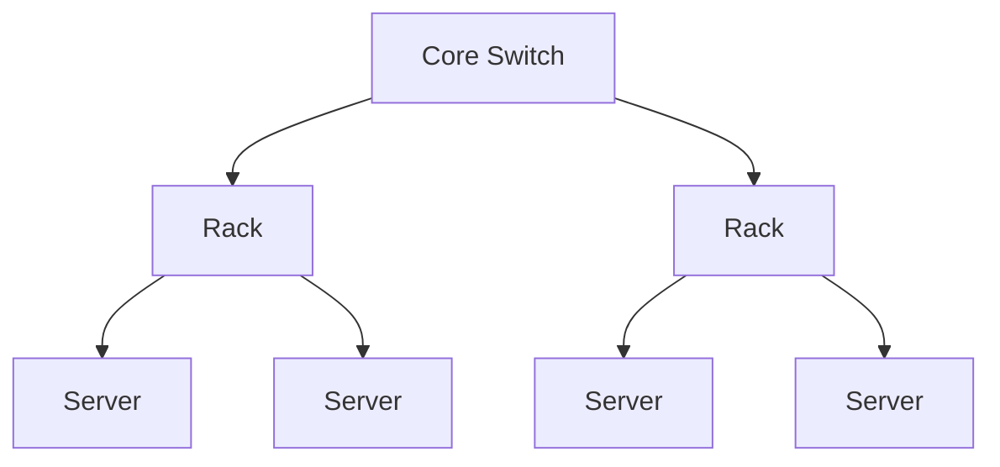

# Introduction
## Basic Datastructure

|Queue|Stack|
|-----|-----|
|First-in First-out|First-in Last-out|
|Insert at tail|Insert (Push) at top|
|Remove from head|Remove (Pop) from top|

## Process

|Name|Description|
|----|-----------|
|Stack| Passes Args and return values among function|
|Program Counter| Points the line number of execution|
|Heap and Register|Holds Variables' values|

## Architecture
- A program you write (C++, Java, etc.) gets compiled to low-level machine instructions
	- Stored in file system on disk
- CPU loads instructions in batches into memory (and cache, and registers)
- As it executes each instruction, CPU loads data for instruction into memory (and cache, and registers)
	- And does any necessary stores into memory
- Memory can also be flushed to disk

## Big O() Notation
- One of the most basic ways of analyzing algorithms
- Describes upper bound on behavior of algorithm as some variable is scaled (increased) to infinity
- Analyzes run-time (or another performance metric)
- Worst-case performance
> Algorithm A is O(N) : Algorithm A takes < c * N time to complete, for some constant c, beyond some input size n
- constant c is ignored


## Probability
- $P(E_1 \land E_2) = P(E_1) * P(E_2)$ when E1 is independent of E2
- $P(E_1 \lor E_2) = P(E_1) + P(E_2) - P(E_1 \land E_2)$

## Others
- DNS = Domain Name System
	- Collection of servers, throughout the world
	- Input to DNS: a URL
	- Output from DNS: IP address of a web server that hosts that content
	- IP address may refer to either
		-  Web server actually hosting that content, or
		-  An indirect server, e.g., a CDN (content distribution network) server


# Clouds
- A cloud consists of
	- Hundreds to thousands of machines in a datacenter (server side)
	- Thousands to millions of machines accessing these services (client side)
	- Servers communicate amongst one another -> Distributed System (Cluster)
	- Clients communicate with servers 
	- Clients also communicate with each other -> P2P System

- Types of Cloud
	- Private clouds are accessible only to a company employee
	- Public clouds provide service to any paying customer

- A single-site cloud (aka “datacenter”) consists of
	- Compute nodes (grouped into racks)
	- Switches, connecting the racks
	- A network topology, e.g., hierarchical
	- Storage (backend) nodes connected to the network
	- Front-end for submitting jobs and receiving client requests
	- Software services
- A geographically distributed cloud consists of
	- Multiple such sites
	- Each site perhaps with a different structure and services


- History
	- First Datacenters: ENIAC, ORDVAC, ILLIAC (1940 - 1960) - (used vacuum tubes and mechanical relays)
	- Data Processing and Time Sharing Industry - 1960 - 1980
	- Super Computers / Server Farms - 1980
	- Grids/Clusters - 1980 - 200
	- P2P System 1990-2000
	- Cloud / Datacenters 

## Features
1. **Massive scale**
	- WUE = Annual Water Usage / IT Equipment Energy (L/kWh) (low is good)
	- PUE = Total Facility Power / IT Equipment Power (low is good) 
1. **On-demand access**: Pay-as-you-go, no upfront commitment.
	- Anyone can access it
1. **Data-intensive Nature**: What was MBs has now become TBs, PBs and XBs.
	- lots of data => need a cluster (multiple machines) to store
	- Daily logs, forensics, Web data, etc.
	- Humans have data numbness: Wikipedia (large) compress is only about 10 GB!
1. **New Cloud Programming Paradigms**: MapReduce/Hadoop, NoSQL/Cassandra/MongoDB and many others.
	- High in accessibility and ease of programmability
	- Lots of open-source

### *AAS Classification
1. **HaaS**: Hardware as a Service
	- You get access to barebones hardware machines, do whatever you want with them, ex: your own cluster
	- Not always a good idea because of security risks
1. **IaaS**: Infrastructure as a Service
	- You get access to flexible computing and storage infrastructure. 
	- Virtualization is one way of achieving this (what’s another way, e.g., using Linux). 
	- Often said to subsume HaaS.
	- Ex: Amazon Web Services (AWS: EC2 and S3), Eucalyptus, Rightscale, Microsoft Azure
1. **PaaS**: Platform as a Service
	- You get access to flexible computing and storage infrastructure, coupled with a software platform (often tightly)
	- Ex: Google’s AppEngine (Python, Java, Go)
1. **SaaS**: Software as a Service
	- You get access to software services, when you need them. 
	- Often said to subsume SOA (Service Oriented Architectures).
	-  Ex: Google docs, MS Office on demand


### Others

|Computation-Intensive|Data-Intensive|
|---------------------|--------------|
|Example areas: MPI-based, high-performance computing, grids|Typically store data at datacenters|
|Typically run on supercomputers|Use compute nodes nearby|
| |Compute nodes run computation services|
|focus on computation (CPU utilization)|focus on data (I/O operations)|

- Easy to write and run highly parallel programs in new cloud programming paradigms


## Operating System
- The low-level software which handles the interface to peripheral hardware, schedules tasks, allocates storage, and presents a default interface to the user when no application program is running.
- The OS may be split into a kernel which is always present and various system programs which use facilities provided by the kernel to perform higher-level house-keeping tasks, often acting as servers in a client-server relationship.
- Some would include a graphical user interface and window system as part of the OS, others would not. The operating system loader, BIOS, or other firmware required at boot time or when installing the operating system would generally not be considered part of the operating system, though this distinction is unclear in the case of a roamable operating system such as RISC OS.
- The facilities an operating system provides and its general design philosophy exert an extremely strong influence on programming style and on the technical cultures that grow up around the machines on which it runs.


## Distributed System
- A distributed system is a collection of independent computers that appear to the users of the system as a single computer.
- A distributed system is several computers doing something together. Thus, a distributed system has three primary characteristics: multiple computers, interconnections, and shared state.

>A distributed system is a collection of entities, each of which is autonomous, programmable, asynchronous and failure-prone, and which communicate through an unreliable communication medium.

- programmable >> Eliminates “Humans Interacting with each other”
- asynchronous >> Distinguishes distributed systems from parallel systems (e.g., multiprocessor systems)

# Map Reduce
|Map|Reduce|
|---|------|
|Process individual records to generate intermediate Key / value pairs| Reduce processes and merge all intermediate values associated per key|
|Parallely process individual records to generate intermediate key / value pairs|Each key assigned to one Reduce |
| Parallely process a large number of individual records to generate intermediate key/value pairs| Parallely process and merges all intermediate value by partitioning Keys <br>like hash partitioning, i.e., key is assigned to reduce # = hash(key) % no. of reduce servers|
|Output sorted (quicksort)| Output sorted (mergesort)|
- Partitioning function - partitioning keys across reducers based on ranges: take data distribution into account to balance reducer tasks


## Architecture
- User
	- Write MAP and Reduce program
	- Submit Job
- Internally: Paradigm and Scheduler
	- Parallelize Map : Map tasks are independent of each other
	- Transfer data from MAP to Reduce
		- All Map output records with same keys assigned to same Reduce task
		- Using Partitioning Function
	- Parallelize Reduce : Reduce tasks are independent of each other
	- Implement Storage for Map Input, output and Reduce input, Output
		- Map Input: from Distributed file system
		- Map output: to local disk (MAP node), local file system
		- Reduce input: from multiple remote disk, uses local file system
		- Reduce output : to distributed file system 
	- Ensure that no Reduce Starts before all Maps are finished, creating a barrier between MAP and Reduce Phases
	- **Resource Manager**: assigns maps and reduces to servers

### YARN
- Yet another Resource Negotiator
	- Server = Collection of containers
	- Container = CPU + Memory
- Components
	- Global Resource Manager (RM) : Scheduling
	- Per-server Node Manager (NM) : Daemon and server specific functions
	-  Per-application /job Application manager (AM) : Container Negotiation with RM and NM, Detect Task failure of that job


### Fault Tolerance
- Server Failure
	- NM heartbeats to RM
		- if server fails, RM lets all affected AMs know, and AMs take action
	- NM keeps track of each task running at its server
		- if task failes while in-progress, mark the task as idle and restarts it
	- AM heartbeats to RM
		- On failure, RM restarts AM, which then syncs up wuth its running tasks
- RM failure
	- Use old checkpoints and bring up secondary RM
- Heartbeats also used to piggyback container requests to avoid extra messages
- Slow servers
	- Stragglers / Slow nodes
	- Keep track of progress of each task
	- perform backup / replicated execution of straggler task
	- Speculative execution - task considered done with the first replica finishes
- Locality
	- cloud has hierarchical topology
	- GFS / HDFS stores 3 replicas of each chunks (2 in 1 rank, 1 in another)
	- MR attemps to schedule a Map task based on below priority:
		- A machine that contains a replica corresponding input , or
		- On the same rack as a machine containing the input, or
		- Anywhere


# Gossip
- Node with a piece of info to be communicated to everyone
- Distributed group of "Nodes" = Processes at internet-based host
- Multicast Sender Issues
	- Nodes may crash
	- Packets may be dropped
	- 1000's of Nodes
- Info is sent using UDP / TCP packets
- Issues
	- Fault Tolerance
	- Scalability
	- Centralized
- Fast, Reliable, fault-tolerant, scalable, topology-aware

## Tree based Multicast Protocold
- Build a spanning tree among the processes of the multicast group
- Use spanning tree to disseminate multicasts
- Use either acknowledgments (ACKs) or negative acknowledgements (NAKs) to repair multicasts not received 
- SRM (Scalable Reliable Multicast)
	- Uses NAKs
	- But adds random delays, and uses exponential backoff to avoid NAK storms
- RMTP (Reliable Multicast Transport Protocol)
	- Uses ACKs
	- But ACKs only sent to designated receivers, which then re-transmit missing multicasts
 - These protocols still cause an $O(N)$ ACK/NAK overhead

## Endemic Multicast / Gossip
- Periodically transmit Gossip Messages to b random targets
- Other nodes do the same after receiving multicast
- Protocol Rounds (Local Clock) b random targers per rounds

### Push vs. Pull
- “Push” gossip
	- Once you have a multicast message, you start gossiping about it
	- Multiple messages:  Gossip a random subset of them, or recently-received ones, or higher priority ones
- “Pull” gossip
	- Periodically poll a few randomly selected processes for new multicast messages that you haven’t received
	- Get those messages
- Hybrid variant: Push-Pull

### Push : Analysis
- Simple Push Protocol is
	- Lightweight in large groups
	- spreads a multicast quickly
	- Highly fault tolerant
#### Low Latency, Reliability, Lightweight
- Assumption
	- Population of (n+1) individuals mixing homogeneously
	- Contact rate between any individual pair is $\beta$
	- At any time, each individual is either uninfected (numbering x) or infected (numbering y)
	- Then, $x_0 = n,y_0=1$
	  and at all times $x+y = n+1$
	- Infected–uninfected contact turns latter infected, and it stays infected
	- Continuous time process
		- Then $\frac{dx}{dt} = - \beta x y$ , Solution:
$$
	x = \frac{n(n+1)}{n+e^{\beta (n+1)t}} ,
	y= \frac{n+1}{1+ne^{-\beta (n+1)}}
$$
-
	- Protocol Rounds (Local Clock) b random targers per rounds , $\beta = \frac{b}{n}$
	- Substituting, at time $t = c *log(n)$, 
		- the number of infected is $y\approx(n+1)-\frac{1}{n^{c*b-2}}$
	- Considering c,b to be small numbers independent of n
		- within $c*log(n)$ rounds, **[Low Latency]**
		- all but $\frac{1}{n^{c*b-2}}$ no. of nodes receive the multicast **[Reliability]**
		- each node has transmitted no more than $c*b*log(n)$ gossip messages **[Lightweight]**
		
		
#### Fault Tolerance
- Packet Loss
	- 50% packet loss : analyzed with b replaced with b/2
	- To achieve same reliability as 0% packet loss, takes twice as many rounds
- Node failure
	- 50% of node fail: analyze with n replaced with n/2 and b replaced with b/2

### Pull : Analysis
- In all forms of gossip, it takes O(log(N)) rounds before about N/2 gets the gossip
	- Because that’s the fastest you can spread a message – a spanning tree with fanout (degree) of constant degree has $O(log(N))$ total nodes
	- Thereafter, pull gossip is faster than push gossip
	- After the ith, round let be the fraction of noninfected processes. Then 
	$p_{i+1}=(p_i)^{k+1}$ where k = no. of gossip pulls / round / process
	- This is super-exponential
	- Second half of pull gossip finishes in time
O(log(log(N))

### Topology Aware Gossip
- Network topology is hierarchical
- Random gossip target selection cause coure router to face a lod = $O(log(N))$
- Fix: In Subnet i, which contains $n_i$ nodes, pick gossip target in the same subnet with probability $1/n_i$
	- The Router Load = O(1)
	- Dissemination time = O(log(N))


# Membership
- Frequency of failure goes up linearly with size of datacenter
- Mean Time To Failure (MTTF) = Time for 1 node to fail /no of Nodes in Datacenter
- Failure Detection targets
	- Process group-based systems
		- Clouds / Datacenters
		- Replicated servers
		- Distributed Databases
	- Crash-stop / Fail-stop process failures

<center>


</center>


## Gossip-style Membership

<center>


</center>

- If the heartbeat has not increased for more than $T_{fail}$ seconds, the member is considered failed
- After $T_{cleanup}$ seconds, it will delete the member from the list
- $T_{cleanup}$ helps to make sure that the deleted record is not overwritten by the Membership list of another node

- What happens?
	- if $T_{gossip}$ is decreased? : False Positive Increases, Detection Time decreases
	- Single hearbeat or N hearbeat takes $O(log(N))$ time to propagate , if bandwidth allowed per node is $O(N)$
	- Single hearbeat or N hearbeat takes $O(Nlog(N))$ time to propagate , if bandwidth allowed per node is $O(1)$
	- for partial membership list it will be similar to the case where banwidth allowed is $O(k)$
- Tradeoffs:
	- False positive rate
	- Detection Time
	- Badwidth

## Failure Detection
- Properties
	- Completeness = 
	- Accuracy = 
	- Speed = 
	- Scale = 

|Completeness|Accuracy|Speed|Scale|
|------------|--------|-----|-----|
|Each failure is detected|there is no Mistaken detection|Time to first detection of failure|Equal load on each member <br> Network Load|
|Impossible together in lossy network||.|.|
|Prefer: Guaranteed|Prefer: Partial/ probabilistic Guarantee|Time until some process detects the failure|No bottlenecks / single failure point|
|Required: In spite of arbitrary simultaneous process failures||||
|Guarantee always|Probability PM(T)|T time units|N/w load: vary with protocol|


### Types
- Centralized Heartbeating
	- All Nodes send heartbeats to a centalized Node periodically
	- If heartbeat is not received from pi within timeout, mark pi as failed
	- Problem: Pj becomes Hotspot
- Ring heatbeating
	- Ring topology
	- Predecessor and Sucessor is know to the node
	- Problem: Unpredictable on simultaneous multiple failures
- All-to-All heartbeating
	- Problem: equal load on each member, bandwidth limitation
	- Network Load, $L = N/T$,
	- Now, every $t_g$ units (gossip period), the node sends $O(N)$ gossip messages
	- $T=log(N)*t_g$ 
	- $L_g=N/t_g=N*log(N)/T$
	- Worse Case load, independent of Message loss probability $p_{ml}$ is $L^{*}=\frac{long(PM(T))}{long(p_{ml})}*\frac{1}{T}$
	- Optimal Load is independent of N
		> All-to-All and Gossip-based are **Sub-optimal**
	- Sub-Optimal features in All-toAll
		- $L=O(N/T)$ 
		- achieve simultaneous detection at all/ k processes
		- No difference between *Failure Detection* and *Dissemination* components
- Swim Failure Detector
	- Ping Random Nodes
	- Receive Ack - Direct or Indirect
	- First Detection Time
		- Expected $[\frac{e}{e-1}]$ periods
		- Constant (independent of group size)
	- Process Load
		- Constant per period
		- $<8L^*$ for $15\%$ loss
	- False Positive Rate
		- Tunable via K
		- Falls exponentially as load is scaled
		- PM(T) is exponentiall in -K. Also depends on pml( and pf)
	- Completeness
		- Deterministic time-bounded
		- Within $O(log(N))$ period w.h.p.
		- Any alive member detects failure
			- eventually
			- by using a trick within worst case O(N) protocol periods.
				- Select each membership element once as a ping target in a traversal
					- Round-robin pining
					- Randompermutation of list after each traversal
				- Each failure is detected in worst case 2N-1 local protocal periods
				- preservers FD properties
	- Prob of being pinged in $T^{'}=1-(1-\frac{1}{N})^{N-1}=1-e^{-1}$
		- $E[T]=T'.\frac{e}{e-1}$

## Dissemination
- Multicast (Hardware / IP)
	- unreliable
	- multiple simultaneous multicasts
- Point-topoint (TCP / UDP)
	- expensive
- Piggyback on Failure Dector message
	- Zero extra message
	- Infection-style Dissemination

### Infection Style Dissemination
- Epidemic style dissemination
	- After $\lambda.log(N)$ protocol periods, $N^{-(2\lambda - 2)}$ processes would not have heard about an update
- maintain a buffer of recently joined / evicted processes
	- Piggyback from this buffer
	- Prefer recent updates
- Buffer elements are garbage collected after a while
	- After $\lambda.log(N)$ protocol periods; this defines weak consistency

### Suspicion mechanism
- False detections, due to
	- perturbed processes
	- packet losses, e.g., form congestion
- Indirect pinging may not solve the problem
	- e.g., correlated message looses near pinged host
- Suspect a process before declaring it as failure in the group

<center>


</center>

- Distinguish multiple suspicions of a process
	- per-process *incarnation Number*
	- *Inc #* for $p_i$ can be incremented only by $p_i$
		- e.g. when it receives a (Suspect,$p_i$) message
	- Somewhat similar to DSDV
- Higher *Inc #* notification over-ride lower *Inc #*
- Within an *Inc #*: (Suspect Inc #) > (Alive Inc #)
- (Failed Inc #) overrides everything else

# Grids
- Computation-intensive Computing / High Performance Computing (HPC)
- May take several hours / days
- 4 Stages
	- Init
	- Stage in
	- Execute
	- Stage Out
	- Publish
- Computation Intensive, massively Parallel
- Problem : Scheduling

## 2-Level Scheduling
- Between Sites : Globus Protocol
	- External Allocation & Scheduling
	- Stage in & Stage Out of Files
- Intra Site protocol (HTCondor protocol) is responsible for
	- Inter Allocation & Scheduling
	- Monitoring
	- Distribution and Publishing of Files
- Condor Highlights
	- High-throughput computing system
	- Cycle-scbenging systems
		- Run on a lot of workstations
		- When workstation is free ask sites' central server / Globus for tasks
		- If user hits a keystroke or mouse click, stop task
			- Either kill task / ask server to reschedule task
		- Can also run on dedicated machines

## Security Issues
- Important as they are federated, no single entry controls the entire infrastructure
- Solutions
	- Single Sign on: Collective job set should require once-only user auth
	- Mapping to local security mechanism: some titest use Kerberos, other using Unix
	- Delegation: Credentials to access resources inherited by subcomputations
	- Community Authorization: e.g. third-party Auth
	> These are important in clounds but less as they are typically run under a central control. there the focus is on feature, scale, On-demand


# P2P Systems
- First distributed systems that seriously focused on scalability with respect to number of nodes
- P2P techniques abound in cloud computing systems
	- Key-value stores (e.g., Cassandra, Riak, Voldemort) use Chord p2p hashing
- Widely-deployed P2P Systems
	- Napster
	- Gnutella
	- Fasttrack (Kazaa, Kazaalite, Grokster)
	- BitTorrent
- P2P Systems with Provable Properties
	- Chord
	- Pastry
	- Kelips

## Distributed Hash Table (DHT)
- A hash table allows you to insert, lookup, and delete objects with keys
- A distributed hash table allows you to do the same in a distributed setting (objects=files)
- Performance concerns:
	- Load balancing
	- Fault-tolerance
	- Efficiency of lookups and inserts
	- Locality
- Napster, Gnutella, FastTrack are all DHTs (sort of)
- Chord is a structured peer-to-peer system
- 
## Napster
<center>


</center>

- Client-Server Architecture
- Client (Peers) Store the files
- Server Stores a directory (i.e. filenames with peer pointers)
### Operations
- Join the system
	- Send an http request to well-known url for that P2P service
	- Message routed (after lookup in DNS=Domain Name System) to introducer
		- a well known server that keeps track of some recently joined nodes in p2p system
	- Introducer initializes new peers’ neighbor table
- Pier Connect to Server
	- Upload the list of all the files it wants to share
	- Server maintains list of tuples (```<filename,ip_address,port no.>```)
	- No files are transferred to the server
- Pier File search
	1. Send server keywords to search with
	1. Server searches its list with the keywords (Ternary Tree Algorithm)
	1. Server returns a list of hosts – ```<filename,ip_address,port no.>``` tuples – to client
	1. Client pings each host in the list to find transfer rates
	1. Client fetches file from best host
- All communication uses TCP (Transmission Control Protocol)
	- Reliable and ordered networking protocol

### Problems
- Centralized server a source of congestion
- Centralized server single point of failure
- No security: plaintext messages and passwds
- Indirect copyright violation

## Gnutella

<center>


</center>

- Eliminate the servers
- Client machines search and retrieve amongst themselves
- Peers/servents maintain “neighbors,” this forms an overlay graph
- Clients act as servers too, called servents
- Files are stored at client as well as pier pointers
- Connected in an overlay graph (each link is an internet path)
- Queries flooded out, ttl restricted
- QueryHit (replies) reverse path routed
- Supports file transfer through firewalls
- Periodic ping-pong to continuously refresh neighbor lists
- List size specified by user at peer: heterogeneity means some peers may have more neighbors
- Gnutella found to follow power law distribution $P(\#links=L) ~ L^{-k}$ (k is constant)

### Operations
- Search
	- Gnutella protocol has 5 main message types
		- **Query** (search)
		- **QueryHit** (response to query)
		- **Ping** (to probe network for other peers)
		- **Pong** (reply to ping, contains address of another peer)
		- **Push** (used to initiate file transfer)
	
	- **Message Structure**
		- 0 - 22 : Descriptor Header 
			- 1 - 14 : Descriptor ID - ID of this search transaction
			- 15 - 16 : Payload descriptor - Type of Payload
				- 0x00 Ping
				- 0x01 Pong
				- 0x40 Push
				- 0x80 Query
				- 0x81 Queryhit
			- 17 : TTL - Decremented at each hop, Message dropped when ttl=0 ttl_initial usually 7 to 10
			- 18 : Hops - Incremented at each hop
			- 19 - 22 : Payload length - Number of bytes of message following this header
		- 22 - * : Payload
			- **Payload format - 0x80 Query**
				- 0 - Minimum Speed
				- 1 - Search criteria (keywords)
			- **Payload format - 0x81 Queryhit** 
				- 0 - Num. hits
				- 1 - 2 - Info about responder: port
				- 3 - 6 - Info about responder: ip_address
				- 7 - 10 - Info about responder: Speed
				- 11 - n - Results : (fileindex,filename,fsize)
				- n - n+16 - servent_id : Unique identifier of responder; a function of its IP address
			- **Payload format - 0x40 Push** 
				- same as in received QueryHit: Servent_id
				- same as in received QueryHit: fileindex
				- Address at which requestor can accept incoming connections: ip_address
				- Address at which requestor can accept incoming connections: port
			- **Payload format - 0x00 Ping**
				- No payload
			- **Payload format - 0x01 Pong**
				- Port
				- ip_address
				- Number files shared
				- Num KB Shared
	- Gnutella routes different messages within the overlay graph
	- Query is flooded out, ttl-restricted
	- After Receiving the Query Hit
		- Requestor chooses “best” QueryHit responder
			- Initiates HTTP request directly to responder’s ip+port
		- Responder then replies with file packets after this message
		- HTTP is used as it’s standard, well-debugged, and widely used
		- Range field in GET request is used to support partial file trasnfer
	- If the responder is behind the firewall
		- Requestor sends Push to responder asking for file transfer
		- Responder establishes a TCP connection at ip_address, port specified. Sends using GIV
		- Requestor then sends GET to responder (as before) and file is transferred as explained earlier
	- If requester is behind firewall
		- Doesnot work
	- To avoid duplicate transmissions, each peer maintains a list of recently received messages
	- Query forwarded to all neighbors except peer from which received
	- Each Query (identified by DescriptorID) forwarded only once
	- QueryHit routed back only to peer from which Query received with same Descriptor ID
	- Duplicates with same DescriptorID and Payload descriptor (msg type) are dropped
	- QueryHit with DescriptorID for which Query not seen is dropped
- Peer Sync
	- Peers initiate Ping’s periodically
	- Ping’s flooded out like Query’s, Pong’s routed along reverse path like QueryHit’s
	- Pong replies used to update set of neighboring peers
	- To keep neighbor lists fresh in spite of peers joining, leaving and failing
	
	
### Problem
- Ping/Pong constituted 50% traffic
	- Solution: Multiplex, cache and reduce frequency of pings/pongs
- Repeated searches with same keywords
	- Solution: Cache Query, QueryHit messages
- Modem-connected hosts do not have enough bandwidth for passing Gnutella traffic
	- Solution: use a central server to act as proxy for such peers
	- 	Another solution: FastTrack System
- Large number of freeloaders: 70% of users in 2000 were freeloaders
	- Only download files, never upload own files
- Flooding causes excessive traffic
	- Is there some way of maintaining meta-information about peers that leads to more intelligent routing?
	- Structured peer-to-peer systems: e.g., Chord System

## Fasttrack
- Hybrid between Gnutella and Napster
- Takes advantage of “healthier” participants in the system
- Underlying technology in Kazaa, KazaaLite, Grokster
- Proprietary protocol, but some details available
- Like Gnutella, but with some peers designated as *supernodes*

### Operations
- A supernode stores a directory listing a subset of nearby (<filename,peer pointer>), similar to Napster servers
- Supernode membership changes over time
- Any peer can become (and stay) a supernode, provided it has earned enough reputation
	- Kazaalite: participation level (=reputation) of a user between 0 and 1000, initially 10, then affected by length of periods of connectivity and total number of uploads
	- More sophisticated Reputation schemes invented, especially based on economics (See P2PEcon workshop)
- A peer searches by contacting a nearby supernode

## Bit Torrent

<center>


</center>

### Operations
- File split into blocks (32 KB – 256 KB)
- Download **Local Rarest First block policy**: prefer early download of blocks that are least replicated among neighbors
	- Exception: New node allowed to pick one random neighbor: helps in bootstrapping
- Tit for tat bandwidth usage: Provide blocks to neighbors that provided it the best download rates
	- Incentive for nodes to provide good download rates
	- Seeds do the same too
- Choking: Limit number of neighbors to which concurrent uploads <= a number (5), i.e., the “best” neighbors
	- Everyone else choked
	- Periodically re-evaluate this set (e.g., every 10 s)
	- Optimistic unchoke: periodically (e.g., ~30 s), unchoke a random neigbhor – helps keep unchoked set fresh

## Chord
- Intelligent choice of neighbors to reduce latency and message cost of routing (lookups/inserts)
- Uses Consistent Hashing on node’s (peer’s) address
	- SHA-1(ip_address,port)  -> 160 bit string
	- Truncated to *m* bits
	- Called peer id (number between 0 and $2^m -1$)
	- Not unique but id conflicts very unlikely
	- Can then map peers to one of $2^m$ logical points on a circle
- Structuring Node Comcepts
	- Ring of Peers
	- Peer Pointers
	- Finger tables

<center>


</center>


- File Replication / Storage
	- Filenames also mapped using same consistent hash function
		- SHA-1(filename) ->160 bit string (key)
		- File is stored at first peer with id greater than or equal to its key (mod $2^m$)
	- File cnn.com/index.html that maps to key K42 is stored at first peer with id at or to the clockwise of 42
		- Note that we are considering a different file-sharing application here : cooperative web caching
		- The same discussion applies to any other file sharing application, including that of mp3 files.
	- Consistent Hashing => with K keys and N peers, each peer stores $O(K/N)$ keys. (i.e., < c.K/N, for some constant c)


### Operation
- Search

<center>


</center>

- Search takes O(log(N)) time
	- at each step, distance between query and peer-with-file reduces by a factor of at least 2
	- after log(N) forwardings, distance to key is at most $2^m/2^{log(N)}=2^m/N$ is O(log(N)) with high probability
	- So using successors in that range will be ok, using another O(log(N)) hops
	- O(log(N)) search time holds for file insertions too (in general for routing to any key)
		- “Routing” can thus be used as a building block for 
			- All operations: insert, lookup, delete
	- O(log(N)) time true only if finger and successor entries correct
	
- Failure
	- Node Failure (Intermediate Peer Failure): maintain r multiple successor entries, In case of failure, use successor entries
	- Lookup Failure (Peer with File Failure): replicate file/key at r successors and predecessors 
	
<center>


</center>

- Search under peer failures
	- Choosing $r=2log(N)$ suffices to maintain lookup correctness w.h.p. (i.e., ring connected)
		- Say 50% of nodes fail
		- $P_r$(at given node, at least one successor alive)= $1-(\frac{1}{2}^{2log(N)})=1-\frac{1}{N^2}$
		- $P_r$(above is true at all alive nodes)=$(1-\frac{1}{N^2})^{N/2}=e^{\frac{1}{2N}}\approx 1$
- Other Changes
	- Peers fail
	- New peers join
	- Peers leave

- P2P systems have a high rate of churn (node join, leave and failure)
	- 25% per hour in Overnet (eDonkey)
	- 100% per hour in Gnutella
	- Lower in managed clusters
	- Common feature in all distributed systems, including wide-area (e.g., PlanetLab), clusters (e.g., Emulab), clouds (e.g., AWS), etc.
	- So, all the time, the peers need to update *successors* and *fingers*, and *copy keys*
- New Peers joining
	- Introducer directs N40 to N45 (and N32)
	- N32 updates successor to N40
	- N40 initializes successor to N45, and inits fingers from it
	- N40 periodically talks to neighbors to update finger table
	- Stabilization Protocol (followed by all nodes)
	- N40 may need to copy some files/keys from N45 (files with file id between 32 and 40)
	- A new peer affects $O(log(N))$ other finger entries in the system, on average
	- Number of messages per peer join= $O(log(N)*log(N))$
	- Similar set of operations for dealing with peers leaving
		- For dealing with failures, also need failure detectors
- Stabilization Protocol
	- Concurrent peer joins, leaves, failures might cause loopiness of pointers and failure of lookups
	- Chord peers periodically run a stabilization algorithm that checks and updates pointers and keys
	- Ensures non-loopiness of fingers, eventual success of lookups and O(log(N)) lookups w.h.p.
	- Each stabilization round at a peer involves a constant number of messages
	- Strong stability takes $O(N^2)$ stabilization rounds
- Churn
	- When nodes are constantly joining, leaving, failing
	- Significant effect to consider: traces from the Overnet system show hourly peer turnover rates (churn) could be 25–100% of total number of nodes in system
	- Leads to excessive (unnecessary) key copying (remember that keys are replicated)
	- Stabilization algorithm may need to consume more bandwidth to keep up
	- Main issue is that files are replicated, while it might be sufficient to replicate only meta information about files
	- Alternatives
		- Introduce a level of indirection (any p2p system)
		- Replicate metadata more, e.g., Kelips (later in this lecture series)
- Virtual nodes
	- Hash can get non-uniform -> Bad load balancing
	- Treat each node as multiple virtual nodes behaving independently 
	- Each joins the system
	- Reduces variance of load imbalance


## Pastry
- Assigns ids to nodes, just like Chord (using a virtual ring)
- Leaf Set – Each node knows its successor(s) and predecessor(s)
- Routing tables based prefix matching
- Think of a hypercube
- Routing is thus based on prefix matching and is thus log(N)
- And hops are short (in the underlying network)
- Consider a peer with id 01110100101. It maintains a neighbor peer with an id matching each of the following prefixes:
	- 0*
	- 01*
	- 011*
	- … 0111010010*
- When it needs to route to a peer, say 01110111001, it starts by forwarding to a neighbor with the largest matching prefix, i.e., 011101*
- For each prefix, say 011*, among all potential neighbors with a matching prefix, the neighbor with the shortest round-trip time is selected
- Since shorter prefixes have many more candidates (spread out throughout the Internet), the neighbors for shorter prefixes are likely to be closer than the neighbors for longer prefixes
- Thus, in the prefix routing, early hops are short and later hops are longer
- Yet overall “stretch,” compared to direct Internet path, stays short
- Chord and Pastry protocols
	- More structured than Gnutella
	- Black box lookup algorithms
	- Churn handling can get complex
	- O(log(N)) memory and lookup cost
	- O(log(N)) lookup hops may be high

|System|Memory|Lookup Latency|# Message for a lookup|
|------|------|--------------|----------------------|
|Napster|Client: O(1)<br>Server: O(N)|O(1)|O(1)|
|Gnutella|O(N)| O(N)|O(N)|
|Chord|O(log(N))|O(log(N))|O(log(N))|
|Pastry|O(log(N))|O(log(N))|O(log(N))|

## Kelips

<center>


</center>

- 1 hop Lookup DHT
- k “affinity groups”
	- each with $\sqrt N$ peers
- Each node hashed to a group (hash mod k)
- Node’s neighbors
	- (Almost) all other nodes in its own affinity group
	- One contact node per foreign affinity group
- File can be stored at any (few) node(s)
- Decouple file replication/location (outside Kelips) from file querying (in Kelips)
- Each filename hashed to a group
	- All nodes in the group replicate pointer information, i.e., <filename, file location>
	- Affinity group does not store files
- Lookup
	- Find file affinity group
	- Go to your contact for the file affinity group
	- Failing that try another of your neighbors to find a contact
	- Lookup = 1 hop (or a few)
		- Memory cost O(√ N)
		- 1.93 MB for 100K nodes, 10M files
	- Fits in RAM of most workstations/laptops today (COTS machines)
- Membership lists
	- Gossip-based membership
	- Within each affinity group and also across affinity groups
	- O(log(N)) dissemination time
- File metadata
	- Needs to be periodically refreshed from source node
	- Times out
- Range of tradeoffs available
	- Memory vs. lookup cost vs. background bandwidth (to keep neighbors fresh)


# Key Value Store

